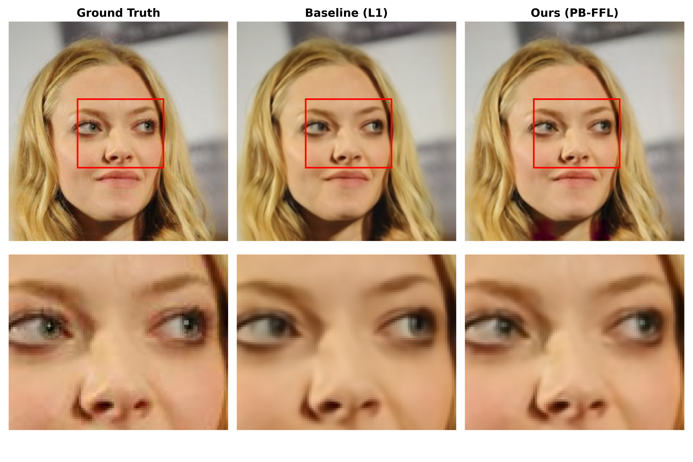
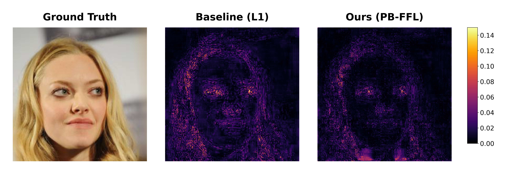

# Patch-based Focal Frequency Loss for Image Reconstruction

This repository contains the official PyTorch implementation of Patch-based Focal Frequency Loss (PB-FFL), proposed to address the spectral bias and high-frequency information loss inherent in Variational Autoencoder (VAE)-based generative models.

## Introduction
Unlike conventional global frequency analysis, the proposed PB-FFL technique utilizes a sliding window approach to simultaneously learn frequency and spatial information in local regions. This prevents the blurring effect during image reconstruction and significantly improves the restoration of fine edges and textures.

## Results

### Quantitative Comparison
Experimental results based on the Enhanced Model using the CelebA-HQ resized (256x256) dataset. The proposed PB-FFL significantly improves not only pixel-level metrics but also human perceptual quality (LPIPS).

| Loss Function | PSNR (↑) | SSIM (↑) | LPIPS (↓) |
| :--- | :---: | :---: | :---: |
| Baseline (L1) | 33.48 | 0.930 | 0.150 |
| Ours (PB-FFL) | 35.64 | 0.950 | 0.110 |

### Qualitative Comparison (Visualizations)
The proposed model demonstrates superior detail reconstruction performance in regions with dense high-frequency information, such as eyes, noses, and hair.

1. Zoom Comparison


2. Error Map Visualization


## Full Paper
Detailed theoretical backgrounds and experimental results can be found in the original bachelor's thesis. Please note that the paper is written in Korean.
* [Patch-based Focal Frequency Loss for Image Reconstruction (PDF)](<Patch-based Focal Frequency Loss For Image Reconstruction.pdf>)

## Repository Structure
```text
Project/
├── checkpoints/          # Folder for trained model weights (.pth)
├── results/              # Folder for visualization results (.png)
├── dataset.py            # CelebA-HQ dataset loader
├── loss.py               # PB-FFL objective function implementation
├── metric.py             # Script for evaluating PSNR, SSIM, LPIPS
├── model.py              # VAE (AutoencoderKL) model architecture
├── train.py              # Model training script
├── utils.py              # Utilities for fixing seeds and loading models
└── visualize.py          # Script for result visualization (Error Map, Zoom)
```

## Requirements
* Python 3.8+
* PyTorch & torchvision
* diffusers
* lpips
* kagglehub
* matplotlib

## Usage

### 1. Training
Run train.py to train the model. The dataset required for training is automatically downloaded via kagglehub.
```bash
python train.py
```

### 2. Evaluation
Use metric.py to measure PSNR, SSIM, and LPIPS metrics.
```bash
python metric.py
```

### 3. Visualization
Use visualize.py to visualize the reconstruction results and Error Maps on the test dataset. Images are automatically saved in the results folder.
```bash
python visualize.py
```

## Pre-trained Models (Checkpoints)
Pre-trained weight (.pth) files are uploaded separately to the [Releases] tab of this repository due to file size limits. To perform evaluation and visualization without training the model from scratch, please download the weight files from the Releases tab and place them in the checkpoints/ directory.
